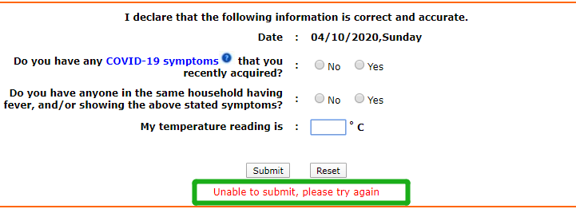

# declare-temp-daily

It's such a hassle to declare the temperature to the company twice every day. And I tend to forget to do so from time to time. This piece of Python program will do this boring chore for me and my wife Ranran.

[Selenium](https://selenium-python.readthedocs.io) will be used to do the job for Ranran.

## **Log #1: Oct 04, 2020 2:59 PM**

Last night I roughly finished the functions of using Selenium to submit the temperature. Only that there was a problem: it will fail and produce an error when Selenium clicks the "Submit" button.



When I do the inputs and clicks manually, there would be no such errors.

I guessed it might be because the web page I'm accessing detects the other party is an automated program, but no real humans. So it refuses to cooperate. 

A simple Google search leaded me to this stack**overflow** post [*Can a website detect when you are using selenium with chromedriver?*](https://stackoverflow.com/questions/33225947/can-a-website-detect-when-you-are-using-selenium-with-chromedriver#41220267) 

I didn't read through the post, but this did confirm my hypothesis. So I got my hands dirty to read the page source. And luckily I found the following JavaScript snippet.

```JavaScript
function detectWebdriver(){
    try{
        if(navigator.webdriver){
            document.dlytemperature.webdriverFlag.value ="Y";
        }
    }catch(err){} 
    
    try{
        if(window.document.documentElement.getAttribute("webdriver")){
            document.dlytemperature.webdriverFlag.value ="Y";
        }
    }catch(err){}
}
```

Now that I know the cause, I'll begin working on it!

## **Log #2: Oct 05, 2020 4:20 PM**

Added a configuration file, from which the program will read the URL, user name and password. Also extracted the function into a method, so later can ease the process of calling it.